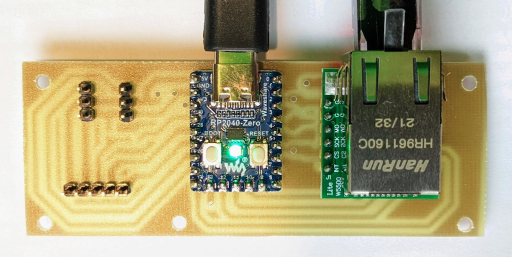
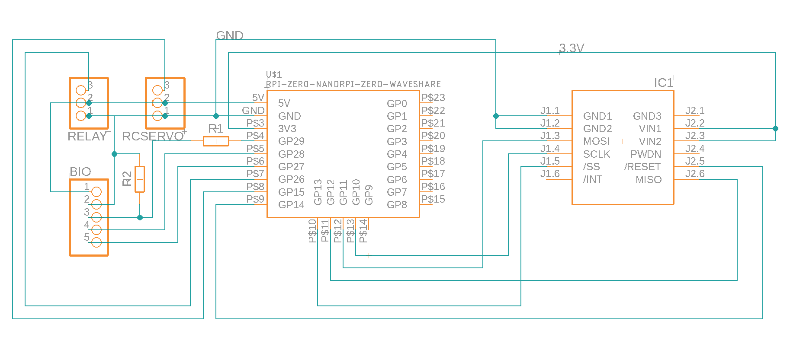

# rp2040_ndsp

[`rp2040_ndsp.py`](rp2040_ndsp.py) is a stripped-down, simple NDSP server which runs on an RP2040 embedded processor, e.g. a Waveshare <a href="https://www.waveshare.com/rp2040-zero.htm">RP2040-Zero board</a> connected to a <a href="https://www.amazon.com/HiLetgo-Ethernet-Network-Interface-WIZ820io/dp/B08KXM8TKJ">W5500 ethernet network module</a>:

</img>

The RP2040 is like a miniature Raspberry PI, and it is used to run <a href="https://learn.adafruit.com/welcome-to-circuitpython/what-is-circuitpython">Adafruit's CircuitPython</a>, with the <a href="https://learn.adafruit.com/ethernet-for-circuitpython">Wiznet5k Ethernet library</a>.  This setup offers 29 multifunction GPIO pins (including four ADC channels) for control by an NDSP:

</img>

This NDSP server can be called from ARTIQ; see [`rp2040_experiment.py`](rp2040_experiment.py) for example.
A convenient way to test this is using the <a href="https://github.com/Technosystem-Labs/dartiq">dartiq</a> dockerized ARTIQ package.  Install that package, enter this into `device_db.py`:
```
device_db = {
    # rp2040 nano NDSP
    "rp2040": {
	"type": "controller",
        "host": "192.168.1.221",
        "port": 3476,
    },
}
```
then run:
```
    dartiq run "artiq_run ./rp2040_experiment.py"
```
and you should see:
```
ping =  Example NDSP is alive!
add result =  18
```

## Installation

For a fresh new RP2040 module:

1. Put the board into UFI bootloader mode, and copy <a href="adafruit/adafruit-circuitpython-raspberry_pi_pico-en_US-7.2.5.uf2">adafruit-circuitpython-raspberry_pi_pico-en_US-7.2.5.uf2<a> onto the RPI-RP2 drive.

2. Wait for the board to reboot and for the CIRCUITPY drive to mount

3. Copy <a href="adafruit/lib">adafruit/lib/*</a> to CIRCUITPY/lib/

4. Copy <a href="rp2040_ndsp.py">rp2040_ndsp.py</a> to CIRCUITPY/code.py

To modify the code, e.g. to change the board's IP address or to enable DHCP:

1. Copy CIRCUITPY/code.py to a local file

2. Edit the file

3. Copy the file back to CIRCUITPY/code.py and wait for it to reboot (look for flashing LEDs)

Debug by connecting to the serial port, following standard CircuitPython procedures.

## Electronics

Board schematic:

</img>
